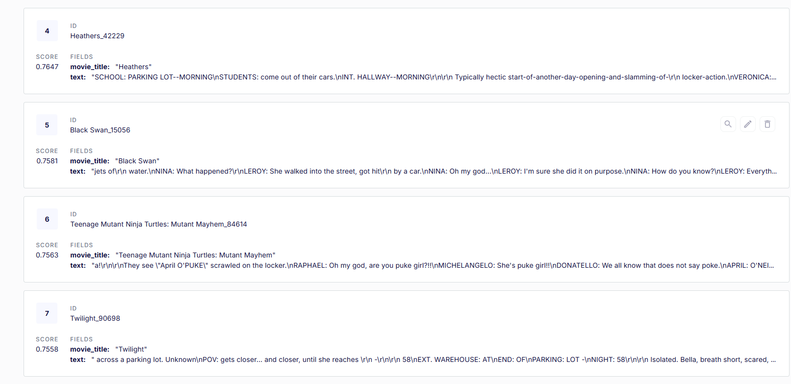

# API Documentation

## Introduction
This document provides details about the available API endpoints, their usage, and expected responses.

---

## **Tech Stack used**
> Fastapi : To host the server

> Gemini : LLM used for chatting

> Pinecone : Vector Database to store embeddings

> MongoDB : Database to store chats and history

> Redis : Cache handling

> BeautifulSoup : To scrap movie scripts from the websites

> Hugging Face's BAAI/bge-large-en-v1.5 Sentence transformer : To get embeddings

> Locust : For testing large amount of requests

---

## **Endpoints**

### 1️⃣ Get User Chats
**Endpoint:** `GET /get_user_chats`

**Description:** Retrieves the chat history of a user.

**Query Parameters:**
- `user_id` (string) - The ID of the user whose chat history is being retrieved.

**Response:**
```json
[
  {
    "chat_id": "12345",
    "messages": ["Hello", "How are you?"]
  }
]
```

---

### 2️⃣ Delete Chat
**Endpoint:** `DELETE /delete_chat`

**Description:** Deletes a specific chat.

**Query Parameters:**
- `chat_id` (string) - The ID of the chat to be deleted.

**Response:**
```json
{
  "status": "Chat deleted successfully"
}
```

---

### 3️⃣ Get Chat History
**Endpoint:** `GET /get_chat_history`

**Description:** Retrieves the message history of a specific chat.

**Query Parameters:**
- `chat_id` (string) - The ID of the chat whose history is being retrieved.

**Response:**
```json
{
  "chat_id": "12345",
  "messages": [
    { "sender": "User", "message": "Hello!" },
    { "sender": "Bot", "message": "Hi! How can I help?" }
  ]
}
```

---

### 4️⃣ Clear Cache
**Endpoint:** `POST /clear_cache`

**Description:** Clears all cached data from Redis.

**Response:**
```json
{
  "status": "Cache cleared"
}
```

---

## **WebSockets**

### **WebSocket Connection**
**Endpoint:** `ws://domain.com/ws`

**Description:** Handles real-time messaging via WebSockets.


**Screenshot Placeholder:**


---

## **Database Integrations**

### **PineconeDB**
Pinecone is used for vector storage and fast retrieval of chat embeddings.

**Screenshot Placeholder:**




---

### **Redis Caching**
Redis is used for caching chat history and user conversations.

**Screenshot Placeholder:**


---
